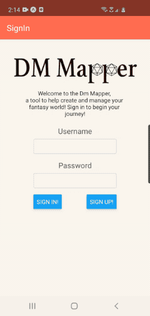

This project was inilialized with expo init.

youtube video
https://youtu.be/yAn3X77H940

This project has a Ruby on Rails backend with the repo located at https://github.com/meniality/DmMapperBackEnd. The backend is hosted on Heroku.

dependencies

react-navigation/native: ^5.0.7,
react-navigation/stack: ^5.0.9,
expo: ~36.0.0,
react: ~16.9.0,
react-dom: ~16.9.0,
react-native: ~0.61.4,
react-native-elements: ^1.2.7,
react-native-gesture-handler: ^1.5.6,
react-native-screens: ^2.0.0-alpha.12,
react-native-vector-icons: ^6.6.0,
react-navigation: ^4.2.1,
react-redux: ^7.2.0,
redux: ^4.0.5,
tcomb-form-native: ^0.6.20

to run

1. in terminal run $npm install expo-cli --global
2. in terminal run $expo start
3. download expo app on android phone
4. start expo app on phone and scan the qr code that was opened in your browser. This will connect the tunnel between your computer and phone.

Dm Mapper is an originzational tool I built to help Dungeon and Game Masters write out and organize thier worlds for the campaigns they run. A user can create any number of campaigns and within those campaign a user can create a card. A card can be anyhing the user needs. A city, a building, a person, even a containing folder for these things as well if wished. Within a card a user can create any number of child or parent relationships between cards. This allows easy linking between information. For example a building could have a child card of a person and automatically that person would then have a parent card of the building. Now we know that within the building is the person. These relationships can be as complicated of simple as the user needs. A card can also have many relationships so a single person for example can belongs to multiple of cards, the whole city, a specific building, another person, etc. A user can also favorite cards so they are sorted to the top of the cards page for east access.

I used expo to build and run the test enviroment with react-navigation in order to switch between screens effeciently. It was neccesary to implement redux into this project in order to pass information between the stack navigation pages. Tcomb forms were used for form management throughout the. project.

